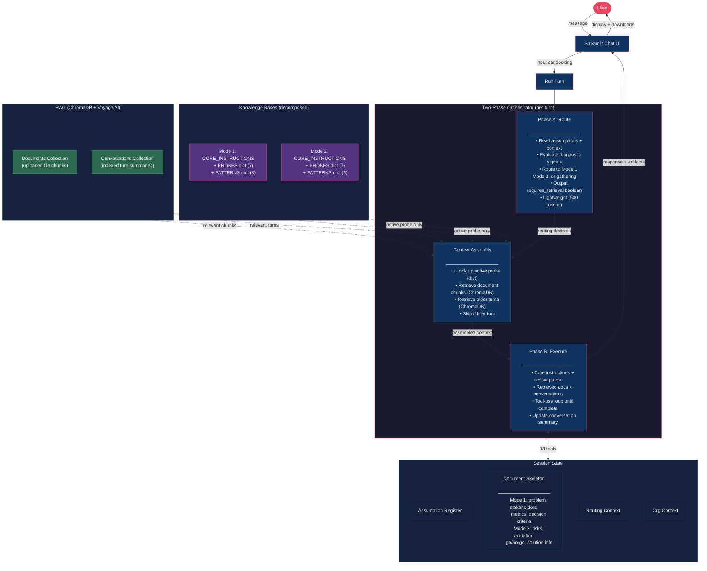

# Forge

An AI-powered product management assistant that helps PMs discover, frame, and rigorously evaluate solutions before committing resources.

> **Status:** Mode 1 (Discover & Frame), Mode 2 (Evaluate Solution), and RAG (intelligent context retrieval) are fully implemented. Modes 3-5 are on the roadmap.

---

## What It Does

Forge is a conversational agent that acts as a thought partner for product managers. Instead of a generic chatbot, it uses a **two-phase orchestrator** with specialized modes to guide structured problem discovery and solution evaluation.

**Core capabilities:**
- **Progressive questioning** — Asks 2-3 focused questions per turn, not a wall of interrogation
- **Assumption tracking** — Registers every assumption with impact, confidence, and dependency chains
- **Structured output** — Builds problem briefs and solution evaluation reports with downloadable artifacts
- **Dual-tone responses** — Blunt analysis for the PM, diplomatic scripts for stakeholder conversations
- **Density-to-risk routing** — Probing depth is driven by assumption risk, not user tone
- **Input sandboxing** — Large pastes (>500 chars) are isolated as source material, preventing prompt injection
- **Document upload** — Upload DOCX/MD files; parsed, chunked, and searchable via vector retrieval
- **Intelligent context retrieval** — Only relevant document chunks and conversation turns enter the prompt (~6K-12K tokens vs 15K-20K+ without RAG)
- **Selective knowledge base** — Only the active probe definition is injected, not all 7 probes
- **Filler turn detection** — Skips retrieval on "yes"/"continue" responses, saving ~3 seconds per filler turn

### Mode 1: Discover & Frame

Answers: *"What's really going on, and is it worth pursuing?"*

Activates when a user presents an unvalidated problem or jumps straight to a solution. Mode 1 applies 7 diagnostic probes (solution-problem separation, why-now trigger, edge mapping, etc.) and 8 domain-specific patterns to surface hidden assumptions and frame the real problem.

Output: downloadable **Problem Brief** with problem frame, stakeholder map, assumption register, success metrics, and go/no-go decision criteria.

### Mode 2: Evaluate Solution

Answers: *"Will this specific approach actually work?"*

Activates when a user proposes a concrete solution after problem context is established. Mode 2 evaluates the solution across Cagan's four risk dimensions using three-layer risk identification:

1. **Conversation-derived** — Risks surfaced from what the user has shared
2. **Org-context-derived** — Risks inferred from organizational patterns and Mode 1 findings
3. **Domain-expert-derived** — Risks from the model's subject matter expertise about the solution type and operating domain

Mode 2 uses 4 semantic tools to progressively populate a structured evaluation as the conversation unfolds, rather than dumping a generic risk checklist.

Output: downloadable **Solution Evaluation Brief** with per-dimension risk assessments (Value, Usability, Feasibility, Viability), evidence for/against, validation plan, and go/no-go recommendation with conditions and dealbreakers.

---

## Architecture



---

## Project Structure

```
project-forge/
├── src/pm_copilot/
│   ├── __init__.py            # Package metadata
│   ├── app.py                 # Streamlit UI, sidebar, file upload, downloads
│   ├── orchestrator.py        # Two-phase engine + RAG context assembly
│   ├── state.py               # Session state initialization
│   ├── tools.py               # 18 tool definitions + handlers
│   ├── prompts.py             # All LLM prompts (system, Phase A, Phase B)
│   ├── mode1_knowledge.py     # Mode 1: CORE_INSTRUCTIONS + PROBES dict + PATTERNS dict
│   ├── mode2_knowledge.py     # Mode 2: CORE_INSTRUCTIONS + PROBES dict + PATTERNS dict
│   ├── rag.py                 # ForgeRAG: ChromaDB storage, Voyage embeddings, context assembly
│   ├── chunking.py            # DOCX/MD → Markdown conversion, hierarchical chunking
│   ├── org_context.py         # Dynamic org context formatter
│   ├── persistence.py         # Project save/load, project_state.json, context.md sync
│   ├── logging_config.py      # Rotating file + console logging setup
│   ├── sidebar_docs.py        # Quick Start and How It Works content
│   └── config.py              # Model names, embedding settings, token limits
├── docs/
│   ├── specs/                 # Behavioral specifications
│   │   ├── orchestrator-spec.md
│   │   ├── mode1-spec.md
│   │   ├── mode2-spec.md
│   │   ├── implementation-spec.md
│   │   ├── rag-architecture-summary.md
│   │   └── rag-implementation-spec.md
│   └── build/                 # Build instructions and playbooks
│       ├── mode1-instructions.md
│       ├── mode1-prompts.md
│       ├── mode2-instructions.md
│       ├── mode2-prompts.md
│       ├── ui-improvements.md
│       └── claude-code-playbook.md
├── pyproject.toml
└── .env.example               # Required environment variables
```

**Per-project directory structure:**

```
~/Documents/forge-workspace/projects/<slug>/
├── state.json              # Session state
├── project_state.json      # File summaries + org context (RAG)
├── context.md              # Org context
├── artifacts/              # Generated deliverables
├── uploads/                # Uploaded source files (.docx, .md)
└── vectordb/               # ChromaDB persistent storage
```

---

## Getting Started

### Prerequisites

- Python 3.11+
- [uv](https://docs.astral.sh/uv/) (recommended) or pip
- An [Anthropic API key](https://console.anthropic.com/)

### Setup

```bash
# Clone the repo
git clone https://github.com/gupta362/project-forge.git
cd project-forge

# Create virtual environment
uv venv
source .venv/bin/activate

# Install dependencies
uv pip install -r requirements.txt

# Set up your API key
cp .env.example .env
# Edit .env and add your Anthropic API key

# Optional: Add VOYAGE_API_KEY for file upload + intelligent retrieval
# Get a free key at https://dash.voyageai.com
# The app works without it, but file upload and context retrieval will be disabled.
```

### Run

```bash
source .venv/bin/activate
streamlit run src/pm_copilot/app.py
```

The app opens in your browser. Type a product problem or idea to start a conversation.

---

## How It Works

Every user message triggers a **two-phase turn**:

### Phase A — Route (lightweight, ~500 tokens)

The orchestrator reads the current assumption register, conversation summary, and recent messages. It evaluates three diagnostic signals (solution specificity, evidence of prior validation, specificity of ask) and produces a routing decision including a `requires_retrieval` boolean (false for filler turns like "yes"/"continue"):

- `ask_questions` — Continue gathering context
- `micro_synthesize` — Summarize progress (every 2-3 turns)
- `enter_mode` — Activate Mode 1 (problem framing) or Mode 2 (solution evaluation)
- `continue_mode` — Stay in active mode
- `flag_conflict` — Contradictory assumptions detected
- `complete_mode` — Mode deliverable is ready

### Context Assembly (between Phase A and Phase B)

If RAG is enabled, the orchestrator assembles targeted context before Phase B:
- **Dictionary lookup** — Active probe definition and triggered patterns (instant, no API calls)
- **Document retrieval** — Relevant chunks from uploaded files via ChromaDB semantic search
- **Conversation retrieval** — Relevant older turns from ChromaDB (outside the always-on window)
- **Filler bypass** — If `requires_retrieval=false`, skips all ChromaDB queries (~3 seconds saved)

Without RAG configured, Phase B falls back to injecting the full knowledge base (legacy behavior).

### Phase B — Execute (heavy, with tool calls)

Based on the routing decision and assembled context, Phase B generates a response and makes tool calls to update session state. With RAG, it receives only `CORE_INSTRUCTIONS` + the active probe + retrieved context (~6K-12K tokens) instead of the full knowledge base (~15K-20K+ tokens).

**Shared tools (all modes):**

| Tool | Purpose |
|------|---------|
| `register_assumption` | Track a new assumption with impact/confidence |
| `update_assumption_status` | Change status (triggers dependency cascade) |
| `update_assumption_confidence` | Update confidence level with new basis |
| `update_problem_statement` | Set problem in document skeleton |
| `update_target_audience` | Set target audience |
| `add_stakeholder` | Add to stakeholder map |
| `update_success_metrics` | Set leading/lagging/anti-metrics |
| `add_decision_criteria` | Define go/no-go conditions |
| `generate_artifact` | Render problem brief or solution evaluation |
| `record_probe_fired` | Track which diagnostic probes were explored |
| `record_pattern_fired` | Track which domain patterns triggered |
| `update_conversation_summary` | Rolling summary for Phase A routing |
| `update_org_context` | Enrich company/domain context |
| `complete_mode` | Signal mode completion |

**Mode 2 semantic tools:**

| Tool | Purpose |
|------|---------|
| `set_solution_info` | Set solution name + description |
| `set_risk_assessment` | Set one risk dimension (level, summary, evidence) |
| `set_validation_plan` | Set riskiest assumption + validation approach |
| `set_go_no_go` | Set recommendation, conditions, dealbreakers |

Phase B runs a **tool-use loop** — it keeps calling the LLM and processing tool results until the model stops making tool calls. This means a single turn can register multiple assumptions, update risk assessments, and generate an artifact all at once.

### Post-Turn

The orchestrator updates routing context (probes fired, patterns fired, conversation summary) so Phase A has fresh data for the next turn. If RAG is enabled and the turn is past the always-on window, a turn summary is generated via Haiku and indexed in ChromaDB for future retrieval.

---

## Downloads

The sidebar provides downloadable artifacts:

- **Problem Brief** (Markdown) — Generated at Mode 1 completion
- **Solution Evaluation Brief** (Markdown) — Generated at Mode 2 completion
- **Assumption Register** (JSON or CSV) — Full register with all fields, exportable for stakeholder meetings

---

## Built With

- **[Streamlit](https://streamlit.io/)** — Chat UI with sidebar for assumptions, skeleton, and artifact downloads
- **[Anthropic Claude API](https://docs.anthropic.com/)** — Claude Sonnet with native tool use, Haiku for turn summaries
- **[ChromaDB](https://www.trychroma.com/)** — Embedded vector database for document and conversation retrieval
- **[Voyage AI](https://www.voyageai.com/)** — voyage-3.5-lite embeddings (512 dims, $0.02/1M tokens)
- **[MarkItDown](https://github.com/microsoft/markitdown)** — DOCX → Markdown conversion
- **[Python](https://python.org/)** — Procedural architecture, flat dicts for state, no frameworks

---

## Roadmap

- [x] **Mode 1: Discover & Frame** — Problem discovery, assumption tracking, problem briefs
- [x] **Mode 2: Evaluate Solution** — Four-dimension risk analysis, domain-expert risks, solution evaluation briefs
- [x] **RAG: Intelligent Retrieval** — Document upload, vector search, selective knowledge base, conversation indexing
- [ ] **Mode 3: Surface Constraints** — Constraint inventory by type and severity
- [ ] **Mode 4: Size & Value** — Opportunity quantification with sensitivity analysis
- [ ] **Mode 5: Prioritize & Sequence** — Multi-option comparison framework

---

## License

This project is not currently licensed for reuse.
