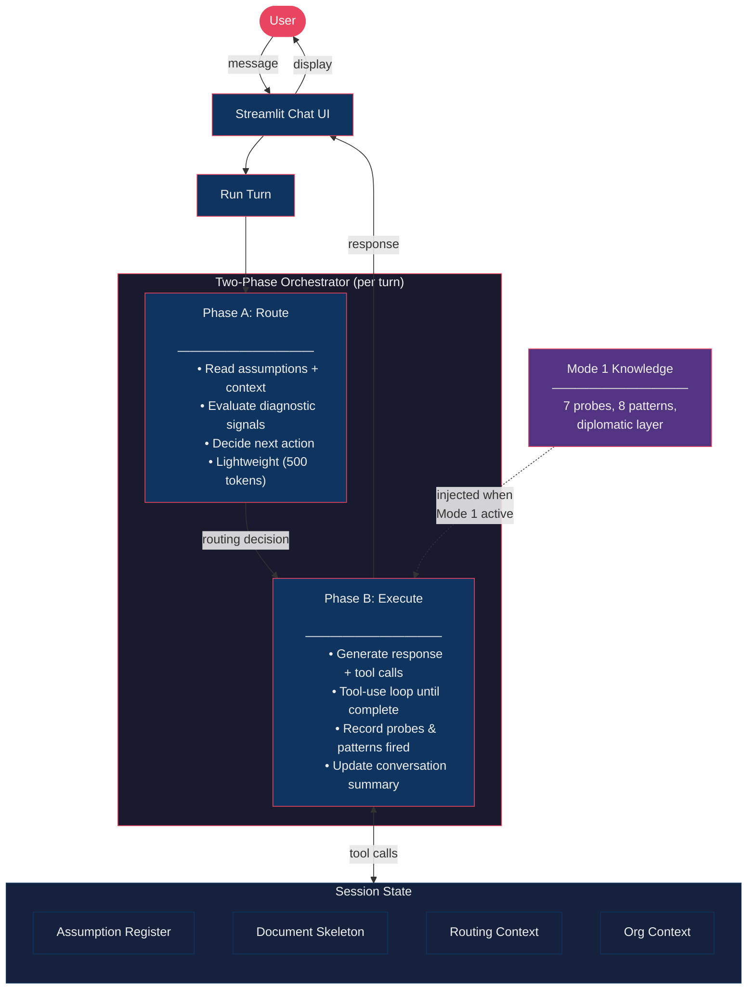

# PM Co-Pilot

An AI-powered product management assistant that helps PMs discover, frame, and validate problems before jumping to solutions.

> **Status:** Mode 1 (Discover & Frame) is fully implemented. Modes 2-5 are on the roadmap.

---

## What It Does

PM Co-Pilot is a conversational agent that acts as a thought partner for product managers. Instead of a generic chatbot, it uses a **two-phase orchestrator** with specialized modes to guide structured problem discovery.

**Core capabilities:**
- **Progressive questioning** — Asks 2-3 focused questions per turn, not a wall of interrogation
- **Assumption tracking** — Registers every assumption with impact, confidence, and dependency chains
- **Structured output** — Builds a problem brief with stakeholder maps, success metrics, and decision criteria
- **Dual-tone responses** — Blunt analysis for the PM, diplomatic scripts for stakeholder conversations
- **Density-to-risk routing** — Probing depth is driven by assumption risk, not user tone

### Mode 1: Discover & Frame

The first (and currently only) mode answers: *"What's really going on, and is it worth pursuing?"*

It activates when a user presents an unvalidated problem or jumps straight to a solution. Mode 1 applies 7 diagnostic probes (solution-problem separation, why-now trigger, edge mapping, etc.) and 8 domain-specific patterns to surface hidden assumptions and frame the real problem.

The output is a downloadable **problem brief** containing the problem frame, stakeholder map, assumption register, success metrics, and go/no-go decision criteria.

---

## Architecture



---

## Project Structure

```
pm-agent-v2/
├── src/pm_copilot/
│   ├── __init__.py            # Package metadata
│   ├── app.py                 # Streamlit UI + chat loop
│   ├── orchestrator.py        # Two-phase engine (Phase A routing, Phase B execution)
│   ├── state.py               # Session state initialization
│   ├── tools.py               # 14 tool definitions + handlers
│   ├── prompts.py             # All LLM prompts (system, Phase A, Phase B, Mode 1)
│   ├── mode1_knowledge.py     # Mode 1 knowledge base (probes, patterns, diplomatic layer)
│   ├── org_context.py         # Dynamic org context formatter
│   └── config.py              # Model names, token limits
├── docs/
│   ├── orchestrator-spec.md   # Full architecture specification
│   ├── mode1-spec.md          # Mode 1 behavioral specification
│   ├── implementation-spec.md # Build specification
│   └── instructions.md        # Developer reference
├── pyproject.toml
├── requirements.txt
└── .env.example               # Required environment variables
```

---

## Getting Started

### Prerequisites

- Python 3.11+
- [uv](https://docs.astral.sh/uv/) (recommended) or pip
- An [Anthropic API key](https://console.anthropic.com/)

### Setup

```bash
# Clone the repo
git clone https://github.com/gupta362/pm-agent-v2.git
cd pm-agent-v2

# Create virtual environment
uv venv
source .venv/bin/activate

# Install dependencies
uv pip install -r requirements.txt

# Set up your API key
cp .env.example .env
# Edit .env and add your Anthropic API key
```

### Run

```bash
streamlit run src/pm_copilot/app.py
```

The app opens in your browser. Type a product problem or idea to start a conversation.

---

## How It Works

Every user message triggers a **two-phase turn**:

### Phase A — Route (lightweight, ~500 tokens)

The orchestrator reads the current assumption register, conversation summary, and recent messages. It evaluates three diagnostic signals (solution specificity, evidence of prior validation, specificity of ask) and produces a routing decision:

- `ask_questions` — Continue gathering context
- `micro_synthesize` — Summarize progress (every 2-3 turns)
- `enter_mode` — Enough context gathered, activate Mode 1
- `continue_mode` — Stay in active mode
- `flag_conflict` — Contradictory assumptions detected
- `complete_mode` — Mode deliverable is ready

### Phase B — Execute (heavy, with tool calls)

Based on the routing decision, Phase B generates a response and makes tool calls to update session state. Tools include:

| Tool | Purpose |
|------|---------|
| `register_assumption` | Track a new assumption with impact/confidence |
| `update_assumption_status` | Change status (triggers dependency cascade) |
| `update_problem_statement` | Set problem in document skeleton |
| `add_stakeholder` | Add to stakeholder map |
| `update_success_metrics` | Set leading/lagging/anti-metrics |
| `add_decision_criteria` | Define go/no-go conditions |
| `generate_artifact` | Render the problem brief |
| `update_org_context` | Enrich company/domain context |

Phase B runs a **tool-use loop** — it keeps calling the LLM and processing tool results until the model stops making tool calls. This means a single turn can register multiple assumptions, update the skeleton, and generate an artifact all at once.

### Post-Turn

The orchestrator updates routing context (probes fired, patterns fired, conversation summary) so Phase A has fresh data for the next turn.

---

## Built With

- **[Streamlit](https://streamlit.io/)** — Chat UI with sidebar for assumptions, skeleton, and artifact download
- **[Anthropic Claude API](https://docs.anthropic.com/)** — LLM with native tool use
- **[Python](https://python.org/)** — Procedural architecture, flat dicts for state, no frameworks

---

## Roadmap

- [x] **Mode 1: Discover & Frame** — Problem discovery, assumption tracking, problem briefs
- [ ] **Mode 2: Evaluate Solution** — Risk analysis for concrete solution approaches
- [ ] **Mode 3: Surface Constraints** — Constraint inventory by type and severity
- [ ] **Mode 4: Size & Value** — Opportunity quantification with sensitivity analysis
- [ ] **Mode 5: Prioritize & Sequence** — Multi-option comparison framework

---

## License

This project is not currently licensed for reuse.
